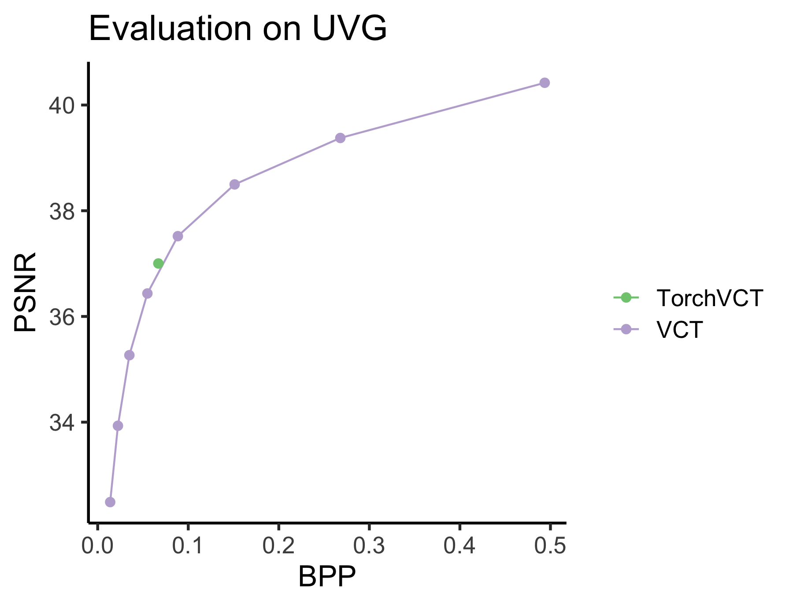

# Reproducing VCT in PyTorch

## Introduction
This is a PyTorch implementation of the recent paper
[VCT: A Video Compression Transformer](https://arxiv.org/abs/2206.07307) by Fabian Mentzer, George Toderici, David Minnen, Sung Jin Hwang, Segi Caelles, Mario Lucic and Eirikur Agustsson, code for which was released in TensorFlow and can be found in the [Google research repo](https://github.com/google-research/google-research/tree/master/vct).

The aim is to reproduce the results from the VCT paper as closely as possible using PyTorch and *publicly* available data. We use the official TensorFlow code along with the original paper as sources.

### Reproduction results

The PSNR and BPP of VCT are from the [VCT repo](https://github.com/google-research/google-research/tree/master/vct#uvg-psnr). Green dot is our reproduction with distortion lambda $\lambda=0.01$.

<p align='center'>
    
</p>

## Running the code
To facilitate training we use `pytorch_lightning` and `hydra` to manage model configurations.

To create an environment with all the requirements for running this code, we suggest first verifying that the PyTorch version in the `environment.yml` file is appropriate for your OS and server and selecting an appropriate one if it is not.
Then create a new `conda` environment by running:
```
conda env create -f environment.yml
conda activate torch_vct
```

You can train a model with `model_train.py` but remember to modify the the training configuration (`config/train_config.yaml`) and include paths to an appropriate training dataset.

### Checkpoint

[TODO] We are working with legal to release checkpoints soon, so stay tuned!

-------

## VCT: Main components

### Image analysis and synthesis transforms
Each frame in a video $x_i, i = 1,\dots, F$ is independently mapped into (resp. from) a quantized latent
representation $y_i$ using standard image analysis (resp. synthesis) transforms.
In its updated version, VCT uses [ELIC transforms](https://arxiv.org/abs/2203.10886).
Concretely, an input frame $x_i$ of shape `[3, I_H, I_W]` is mapped to $y_i$ of shape
`[C, I_H/16, I_W/16]`, where by default $C=192$ and we set `I_H/16=H`, `I_W/16=W`.

- The ELIC transforms are available in `neural/transforms.py`, which also contains
other transforms, e.g. from [Balle et al., 2018](https://arxiv.org/abs/1802.01436).

### Entropy model
At the heart of the VCT framework is a powerful transformer-based entropy model.
It consists of both an encoder and a decoder and is thus similar in spirit to the original transformer architectures used in machine translation ([Vaswani et al., 2017](https://arxiv.org/abs/1706.03762)).
The compression of a video frame (or, more precisely, its latent representation) is therefore viewed as a translation task: the previous two latent representations $(y_{i-2}, y_{i-1})$  are translated to the current one $y_i$.

Concretely, the entropy model $P$ predicts the probability mass function (PMF) of the current latent, conditional on  the last two, $P(y_i \mid y_{i-2}, y_{i-1})$. This PMF is then used by a standard entropy coder to *losslessly* compress and store $y_i$.
The better $P$ predicts this distribution, the fewer bits will be required to store $y_i$.

-  The entropy model is implemented in `neural/entropy_model.py`.

### Entropy coding
VCT uses the [tensorflow compression](https://github.com/tensorflow/compression) library
to perform the actual entropy coding.

- We rely on the entropy coder from [compressai](https://github.com/InterDigitalInc/CompressAI).

------

## VCT: Implementation details

### Training data

VCT is trained on a proprietary dataset with one million internet video clips, each comprising 9 frames. A training batch consists of randomly selected triplets of adjacent frames, cropped to $256\times256$

- We use the publcicly available Vimeo-90k dataset ([Xue et al., 2019](https://arxiv.org/abs/1711.09078)), which is commonly used dataset for both image and video compression. We apply random crop or a random resized crop (one of the two is picked with equal probability) to obtain frames of size $256\times256$. We do not apply subsampling, i.e. a training batch consists of 7 frames.

#### Padding
Inputs are padded to ensure their dimensions are divisible by the down-scaling factor in the analysis transform and patch (window) sizes when tokenizing (discussed below).
The reconstructed latents and frames are cropped back to their original sizes.


### Loss
VCT optimizes a standard rate-distortion (RD) loss with lambda $\lambda >0$ controlling the trade-off:
$$
\mathbb{E}_{x\sim p_x, u\sim p_u} [ -\log p(\tilde{y} + u) + \lambda \text{MSE}(x, \hat{x}) ]
$$
where $p_x$ is the data distribution, $p_u = U[-0.5, 0.5]$, $\tilde{y} = \text{AnalysisTransform}(x)$ is the unquantized latent, and $\hat{x}=\text{SynthesisTransform}(\text{straight-through-round}(\tilde{y}))$.

Since training batches consist of 3 frames, to account for train-inference mismatch, the first frame is weighed lower: with weight=1, whilst the other two frames get a weight of 10.

- We use the same loss, which is defined in the lightning module `model_lightning.py`.

### Tokenization

To obtain 'tokens' for the transformer: the latents are patched into blocks whose size depends on whether the latent has already been transmitted (and therefore acts as an input to the transformer *encoder*) or is the one whose PMF is being predicted (and is an input to the transformer *decoder*).
Suppse we want to transmit $y_i$ using $y_{i-1}, y_{i-2}$:

- the **c**urrent $y_i$ is shape `[C, H, W]` and is patched into *non-overlapping* blocks of size $w_c \times w_c$, where $w_c=4$. Thus we have $N_{c} = H*W /w_c^2=H*W/16$ blocks in total, padding if required to make a full block.
Each block/patch contains $w_c^2=16$ elements (this is the max sequence length of the transformer decoder).
Shape of the patched current latent therefore is `[C, N_c, w_c, w_c]` (which equals `[192, 16, 4, 4]` during training).

- each of the **p**revious latents is also shape  `[C, H, W]`. They are patched into *overlapping* blocks of size  $w_p \times w_p$, $w_p=8$ by default, with stride equal to $w_c$.
This would give us a total of $N_{p} = (H - w_p + w_c) * (W - w_p + w_c) / w_c^2$ blocks.
To ensure that the current latent and previous latents are patched into the same number of blocks, the previous latents are padded symmetrically by adding $(w_p - w_c) / 2$ on each side.
Thus, there are two requirements on $w_p$ and $w_c$: 1) $w_p>w_c$ and 2) $w_p - w_c$ must be divisible by 2.
This gives us $N_{p} = ((H + w_p - w_c) - w_p + w_c) * ((W + w_p - w_c) - w_p + w_c) / w_c^2 = N_c$.
Each block/patch contains $w_p^2=64$ elements (this is the max sequence length of the transformer encoder).
Shape of the patched previous latent therefore is `[C, N_p, w_p, w_p]` (which by default equals `[192, 16, 8, 8]` during training).

#### Independence assumption
The $N_c$ patches are assumed independent. So the transformers will operate independently on the patches, i.e. predicting means and scales for $w_c^2=16$ tokens of dimension $C = 192$ in the current latent patch using $2*w_p^2 = 128$ tokens of the encoded past 2 tokens.

### Transformer encoder:
The encoder takes as an input the flattened blocks of tokens of the past two latents, $y_{i-1}, y_{i-2}$, which are processed first independently by a transformer layer (with learnt positional encoding), then concatenated and processed jointly by another transformer layer (with learnt "temporal" positional encoding).
The resulting representation $z_i := f(y_{i-2, i-1})$, which has shape `[N_p, 2*w_p^2, 4*C]` (which by default equals `[16, 128, 768]` during training), is passed to the transformer decoder and is used to predict the PMF of $y_i$.


### Transformer decoder:

The patched current latent $y_i$ is shifted with a learnt 0 element and embedded into `d_model=4*C` representation space and thus has a shape `[N_c, w_c^2, d_model]`.

At train time:
Training is done in the standard teacher-forcing paradigm using a diagonal mask.
The decoder takes the shifted patched latent and $z_{i}$ as inputs and applies self-attention (latent) and cross-attention (on $z$) to obtain an output `dec_output`, which is passed through `mean` and `scale` linear head layers to obtain the predictions of the means and scales.
The image synthesis transform reuses these outputs of the decoder as features.


At inference time: The decoder takes patched $z_{i}=\lbrace z\_{i}^{(j)}\rbrace \_{j=1}^{N_c}$ as input, and autoregressively computes $p(y^{(j)}\_{i, n+1} \mid z\_{i}^{(j)}, y^{(j)}\_{i, \leq n})$ independently and in parallel for each patch $j=1, \dots, N_c$.
In other words, decoding is done in a standard autoregressive 'left-to-right' way: starting with a learnt initial token $n=0$, the next token $n$ is predicted using $y_{i, \leq n}$ (self-attention) and the output from the encoder $z$ (cross-attention).


### Optimizer

The original version of the VCT model is trained for a total of 3.25M steps (stages 1, 2 and 3, where only stage 3 optimizes all components, see Table 1 in the paper).
According to the Appendix A.2, the updated model is trained for 750K steps (all components optimized jointly) with a learning rate $1e^{-4}$, with 10K steps warm-up, followed by linear annealing to $1e^{-5}$. Training is done on 3 Google Cloud TPUv4 chips.

- We train with Lion optimizer ([Chen et al., 2023](https://arxiv.org/abs/2302.06675)) with weight decay=0.1. The learning rate of $1e^{-4}$ is annealed to $1e^{-5}$ using a cosine scheduler. We train for a total of 400K steps. Training is done on 32 V100 (32GB) cards.

### Evaluation

The VCT model is evaluated on standard benchmarks: UVG and MCL-JCV, reporting the rate (bits per pixel) obtained by performing actual range coding. There are a couple of important details:
 1. The *first* frame of each video is *not* range coded: range coding is applied only to [p-frames](https://github.com/google-research/google-research/blob/3a4c6307e7122e7824d993cfb73d45219a955107/vct/src/models.py#L482), which in VCT are all the frames in a video except for the first one.
 2. Note that the PMFs used by the range coder are produced by the transformer entropy model $P(y_i \mid y_{i-2}, y_{i-1})$. In other words, these means and scales should be calculated at both encode (compress) and decode (decompress) time and should match *exactly*. Due to the non-determinism of transformers on GPU devices, the means and scales from encode time are passed and reused by the range coder at decode time; the discrepancy between means and scales computed at encode vs decode time is computed and reported to be below $1\%$. This is done to avoid catastrophic failure at inference/evaluation time.


### Other implementation details

- Latent factor norm: the latents are scaled by a pre-defined factor `LATENT_NORM_FAC= 35.0` to reduce their norm before feeding them into the transformers (more precisely, the initial linear embedding layers, which do not apply a pre-layer normalization).
    - We keep this factor the same, noting it could potentially be removed if layer norm is applied before the linear embedding layers.

- To avoid very small probabilities, which can cause training instabilities, VCT is trained by incorporating Laplace tail mass ([defaulting to $1e^{-3}$](https://github.com/google-research/google-research/blob/b35c1664117fb8b9f621b0cc1e5a1e74aeeb4232/vct/src/bottlenecks.py#L204)).
    - We do not incorporate Laplace tails but enforce a lower bound on the likelihoods (of $1e^{-9}$).


## Outstanding differences with the original TensorFlow implementation:

- As discussed above, we have not incorporated Laplace tail mass, which can be very beneficial for training stability and thus improve performance.
- There are differences in the choice of optimizer and learning rate annealing schemes, which could potentialy have a big impact on overall performance.
- There could be differences at inference time arising from differences in the entropy coders (those available in `tensorflow_compression` vs `compressai`).

## Acknowledgements
We use [compressai](https://github.com/InterDigitalInc/CompressAI) for actual entropy coding.
We thank the VCT authors, particularly Fabian Mentzer, for the clarifications provided.

-----

References:

Balle, J., Minnen, D., Singh, S., Hwang, S. J., & Johnston, N. (2018). Variational image compression with a scale hyperprior. ICLR. arXiv:1802.01436.

Chen, X., Liang, C., Huang, D., Real, E., Wang, K., Liu, Y., ... & Le, Q. V. (2023). Symbolic discovery of optimization algorithms. arXiv preprint arXiv:2302.06675.

Mentzer, F., Toderici, G., Minnen, D., Hwang, S. J., Caelles, S., Lucic, M., & Agustsson, E. (2022). Vct: A video compression transformer. NeurIPS. arXiv:2206.07307.

Vaswani, A., Shazeer, N., Parmar, N., Uszkoreit, J., Jones, L., Gomez, A. N., ... & Polosukhin, I. (2017). Attention is all you need. Advances in neural information processing systems, 30.

Xue, T., Chen, B., Wu, J., Wei, D., & Freeman, W. T. (2019). Video enhancement with task-oriented flow. International Journal of Computer Vision, 127, 1106-1125.
